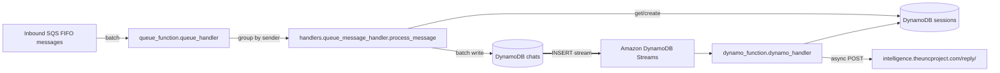

# TheUnc Consumer Service

Serverless message ingestion and processing for inbound chat events using AWS SQS, Lambda, and DynamoDB. The system ingests batched SQS messages, persists normalized chat records, reacts to new chat inserts via DynamoDB Streams, and notifies an external reply service.

### Architecture

- **SQS FIFO**: Receives inbound chat payloads (URL-encoded, Twilio-style fields such as `Body`, `WaId`, `NumMedia`, etc.).
- **`queue_function.queue_handler`**: Parses and groups records by `sender_id`, then delegates to the message handler.
- **`handlers.queue_message_handler`**: Ensures an active session exists per sender, and writes normalized chat items to the `chats` table using batch writes.
- **DynamoDB Streams**: Emits INSERT events for new chat items.
- **`dynamo_function.dynamo_handler`**: Filters inbound chat inserts, de-dupes by sender, and asynchronously notifies the external reply service.
- **External service**: `https://intelligence.theuncproject.com/reply/` is called with `{ sender_id, message }` when a new inbound message arrives.

### Key Modules

- **`config.py`**
  - Loads secrets from AWS Secrets Manager at import time and exports them as environment variables.
  - Uses `AWS_REGION` (default `us-east-1`). Current map includes `INTELLIGENCE_API_SECRET`.

- **`logger_setup.py`**
  - Thin wrapper over Python logging that emits structured JSON logs with methods: `info`, `warning`, `error`, `debug`.

- **`queue_function.py`**
  - Lambda handler: `queue_handler(event, context)`.
  - Warm-up handling for CloudWatch scheduled events.
  - `parse_message_body` converts URL-encoded message body to a normalized dict, including media items, metadata, and sender info.
  - `group_messages_by_sender` batches messages by `sender_id` before processing.

- **`handlers/queue_message_handler.py`**
  - `get_or_create_session(sender_id)`: Reads `sessions` via GSI `SenderSessionsIndex`; creates a new active session if none exists.
  - `store_chat_messages(session_id, sender_id, messages)`: Batch writes normalized chat items to `chats` in chunks of 25, including text, media, segments, sender, and metadata.
  - `process_message(sender_id, messages)`: Orchestrates session retrieval and chat persistence.

- **`dynamo_function.py`**
  - Lambda handler: `dynamo_handler(event, context)`.
  - On `INSERT` records from `chats` stream, unmarshals the new image, filters for `chat_type == "inbound"`, collects unique `sender_id`s, and concurrently calls `notify_reply_service`.

- **`handlers/dynamo_event_handler.py`**
  - `notify_reply_service(sender_id)`: Optionally checks active session and rate limiting (`user_limited_until`, ISO datetime) in `sessions`.
  - Posts asynchronously to the reply endpoint with a small payload and logs non-200 responses.

### Data Model (DynamoDB)

- **Table: `sessions`**
  - Keys: `session_id` (HASH)
  - GSIs:
    - `SenderSessionsIndex` (HASH: `sender_id`, RANGE: `created_at`) — latest active session lookup
    - `StatusIndex` (HASH: `status`, RANGE: `created_at`)

- **Table: `chats`**
  - Keys: `sender_id` (HASH), `message_id` (RANGE)
  - GSIs:
    - `ChatTypeIndex` (HASH: `chat_type`, RANGE: `created_at`)
    - `SenderTimeIndex` (HASH: `sender_id`, RANGE: `created_at`)
    - `SessionIndex` (HASH: `session_id`, RANGE: `created_at`)
  - Streams: Enabled (`NEW_AND_OLD_IMAGES`) to trigger downstream processing.

### Deployment

Automated via GitHub Actions: `.github/workflows/deploy.yml`.

What it does:
- Packages code and dependencies into a zip for Lambda.
- Creates/updates IAM role with permissions for Secrets Manager, SQS, DynamoDB, and CloudWatch Logs.
- Creates/updates DynamoDB `sessions` and `chats` tables (with GSIs) and enables streams.
- Creates/updates FIFO SQS queue and DLQ with redrive policy.
- Creates/updates both Lambda functions and configures environment variables.
- Adds event source mappings for SQS and DynamoDB Streams (INSERT-only filter for the stream).
- Creates CloudWatch log groups and sets a 30-day retention.
- Sets scheduled warmers (CloudWatch Events) every 5 minutes for both Lambdas.

Required GitHub Action secrets:
- `AWS_ACCESS_KEY_ID`, `AWS_SECRET_ACCESS_KEY`, `AWS_ACCOUNT_ID`

Configurable env (see workflow `env:`):
- `AWS_REGION`, `QUEUE_FUNCTION_NAME`, `DYNAMO_FUNCTION_NAME`, `QUEUE_NAME`, `DYNAMODB_CHAT_TABLE`, `DYNAMODB_SESSION_TABLE`

### Runtime Configuration & Secrets

- `AWS_REGION`: Region for AWS clients (defaults to `us-east-1`).
- Secrets Manager: `INTELLIGENCE_API_SECRET` is fetched and set in the environment on import (`config.py`).
- Lambda environment variables are applied by the workflow (e.g., `SQS_QUEUE_URL`, `LOG_LEVEL`).

### Logging & Error Handling

- JSON-structured logs via `logger_setup.get_logger(name)`.
- Defensive parsing and batch writes with warnings for unprocessed items.
- Non-blocking error handling when contacting the external reply service.

### Notes

- `queue_function` expects URL-encoded message bodies with fields typical of WhatsApp/Twilio webhooks (e.g., `Body`, `WaId`, `NumMedia`, `MediaUrl0`, etc.). Upstream should enqueue such payloads to the FIFO SQS queue.
- `dynamo_function` only reacts to new inbound chat inserts (`chat_type == "inbound"`).
- Session-based rate limiting can be enforced by setting `user_limited_until` (ISO string) on an active session record.